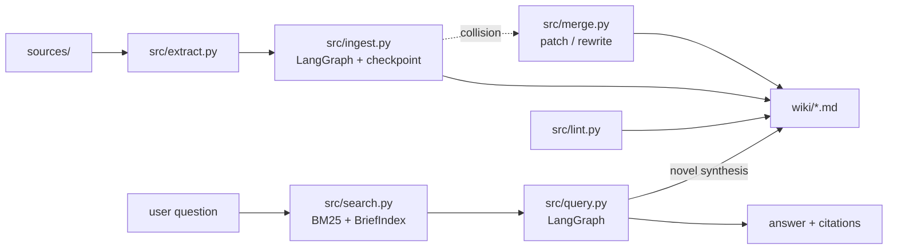

<div align="center">

# LLM Wiki

**Git-backed knowledge base maintained by LLM — Karpathy's LLM Wiki pattern**

[](https://github.com/t-timms/llm-wiki/actions/workflows/ci.yml)
[](https://www.python.org/)
[](https://langchain-ai.github.io/langgraph/)
[]()
[](https://docs.astral.sh/ruff/)
[](LICENSE)

[Quick Start](#quick-start) | [Architecture](#architecture) | [Commands](#commands) | [How It Works](#how-it-works)

</div>

---

## What Is This

A CLI tool that builds and maintains a persistent knowledge wiki from your source documents. Instead of RAG (re-synthesize every query), the LLM incrementally compiles knowledge into interlinked markdown pages — a compounding artifact that gets smarter with every source you feed it.

Based on [Karpathy's LLM Wiki pattern](https://gist.github.com/karpathy/442a6bf555914893e9891c11519de94f). Obsidian-compatible. Git-versioned. Zero database.

**Three layers:**
1. **Sources** — your PDFs, articles, URLs (immutable, you curate)
2. **Wiki** — LLM-generated markdown pages (concepts, entities, syntheses)
3. **Schema** — `schema.yaml` controls how the LLM creates pages

## Why

LLMs hallucinate. Notes apps don't understand context. This tool bridges the gap — a git-backed knowledge base where an LLM structures your information on ingest and retrieves it intelligently on query. Every page has a validated schema, BM25 search finds what you need, and multi-provider LLM routing means it works whether you have API keys or just a local model. Inspired by Andrej Karpathy's LLM Wiki pattern, built for anyone who wants their personal knowledge base to actually *understand* what's in it.

## Quick Start

```bash
# 1. Use this template on GitHub, then clone
git clone https://github.com/YOUR_USER/my-wiki.git
cd my-wiki

# 2. Install
uv sync

# 3. Configure LLM provider (pick one)
cp .env.example .env
# Edit .env — add API key (MiniMax, DeepSeek, Groq, Gemini) or use local Ollama

# 4. Ingest a source
wiki ingest papers/my-paper.pdf

# 5. Query your wiki
wiki query "What are the key findings?"

# 6. Check wiki health
wiki lint
```

## Commands

| Command | What It Does |
|---------|-------------|
| `wiki ingest <file>` | Extract text, create wiki pages with collision detection |
| `wiki ingest <file> --fresh` | Ignore checkpoint, start ingest from scratch |
| `wiki ingest --url <url>` | Ingest from URL |
| `wiki ingest-all` | Batch ingest all files in sources/ with concurrency |
| `wiki query "<question>"` | Search wiki, synthesize answer with citations |
| `wiki lint` | Find orphans, broken links, missing fields |
| `wiki stats` | Page count, link density, tag distribution |

## Architecture



**Core modules:**

| Module | Responsibility |
|--------|---------------|
| `src/cli.py` | Click CLI entry point |
| `src/config.py` | pydantic-settings, WIKI_ env prefix, schema.yaml loader |
| `src/models.py` | Pydantic schemas for all data structures |
| `src/llm.py` | LiteLLM wrapper, instructor structured output, multi-provider fallback |
| `src/extract.py` | Text extraction from PDF (pymupdf), URL (trafilatura), text/markdown |
| `src/wiki.py` | Wiki CRUD: markdown read/write, frontmatter parse, wikilinks, slugify |
| `src/search.py` | BM25 index (rank-bm25) + BriefIndex for fuzzy title dedup |
| `src/ingest.py` | LangGraph: extract→chunk→batch process→merge collisions→write→update links |
| `src/query.py` | LangGraph: search→retrieve→synthesize→optionally persist |
| `src/lint.py` | Sync checks: orphans, broken refs, stale, missing fields |
| `src/merge.py` | Page merge: patch-first with fallback rewrite |
| `src/patch.py` | Edit/patch application with fuzzy string matching |

## How It Works

### Ingest Pipeline (LangGraph)

```
source file → extract text → chunk → batch process (LLM) → collision detection → merge or create → write markdown
```

**Checkpoint/Resume:** Interrupted ingests can resume from last completed batch. Use `--fresh` to ignore checkpoints.

**Collision Handling:** When new content matches an existing page title:
1. LLM decides MERGE or SKIP per collision pair (batch mode)
2. MERGE uses patch-first approach (up to 3 attempts with fuzzy string matching)
3. Falls back to full rewrite if all patch attempts fail

### Query Pipeline (LangGraph)

```
question → BM25 search → retrieve top pages → LLM synthesizes answer → optionally persist as synthesis page
```

The LLM decides if its synthesis is novel enough to become a permanent wiki page — turning exploration into durable knowledge.

### Wiki Pages

Every page is Obsidian-compatible markdown with YAML frontmatter:

```markdown
---
title: "Transformer Architecture"
type: concept
sources: ["papers/attention.pdf"]
tags: ["deep-learning", "attention"]
confidence: high
brief: "A neural network architecture using self-attention mechanisms..."
created: 2026-05-21
updated: 2026-05-21
related: ["self-attention.md", "bert.md"]
---

# Transformer Architecture

The Transformer uses self-attention...
```

**Page types:** `concept`, `entity`, `source_summary`, `synthesis`

## LLM Providers

Uses LiteLLM — works with any provider. Configure one as primary or let the system try all available:

| Provider | Environment Variable | Default Model |
|----------|---------------------|---------------|
| MiniMax | `WIKI_MINIMAX_API_KEY` | minimax/minimax-m2.7 |
| DeepSeek | `WIKI_DEEPSEEK_API_KEY` | deepseek/deepseek-v4-flash |
| Groq | `WIKI_GROQ_API_KEY` | groq/meta-llama/llama-4-scout-17b-16e-instruct |
| Gemini | `WIKI_GEMINI_API_KEY` | gemini/gemini-2.5-flash |
| Ollama | `WIKI_OLLAMA_HOST` (local) | ollama/qwen2.5:3b |

Set `WIKI_LLM_PROVIDER` to select a specific cloud provider (e.g., `deepseek` or `minimax`). When empty, all providers with API keys are tried in order.

## Configuration

All config via `WIKI_` env prefix. Key settings:

```bash
WIKI_WIKI_DIR=wiki              # Wiki pages directory
WIKI_SOURCES_DIR=sources       # Source files directory
WIKI_SCHEMA_PATH=schema.yaml    # LLM behavior config
WIKI_MAX_CHUNK_TOKENS=4000      # Max tokens per chunk
WIKI_MAX_PAGES_PER_INGEST=15    # Max pages per source
WIKI_BATCH_SIZE=5               # Pages per LLM call
WIKI_MAX_CONCURRENT_LLM=3       # Concurrency for ingest-all
WIKI_LOG_LEVEL=INFO             # DEBUG, INFO, WARNING, ERROR
```

## License

MIT
